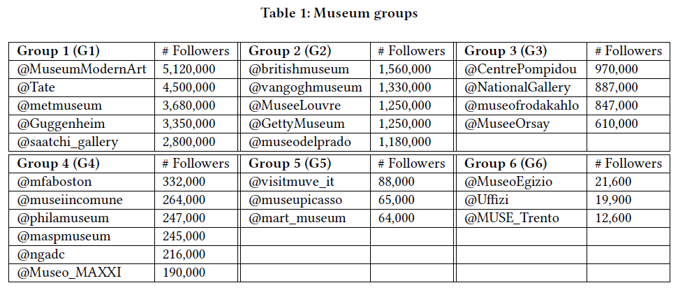
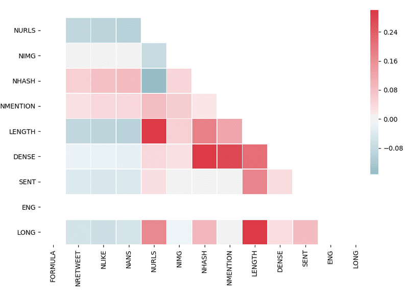
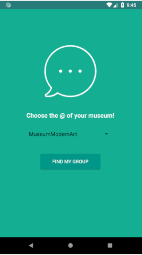
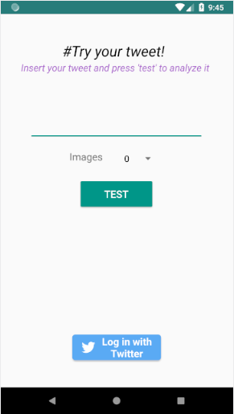
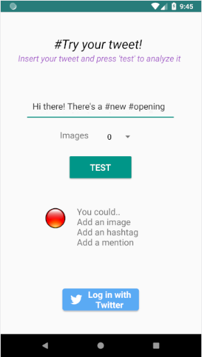
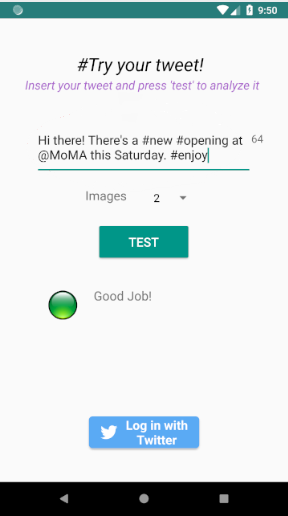
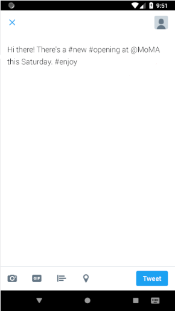

# SmartTweets
Progetto finale di studio per la tesi triennale, consistente nello sviluppo di una **dashboard** intelligente al fine di creare tweet più **efficienti**, per poter pubblicizzare **musei** e altri settori culturali. Tale progetto si pone numerosi **obiettivi**, tra i quali spiccano:
<ul>
<li> Implementare un modello a <strong>classificatore</strong> che fosse in grado di categorizzare i tweet a seconda del loro effetto sul pubblico.</li>
<li> Sviluppare una <strong>dashboard</strong> intelligente per dispositivi mobili, facile ed intuitiva da usare, destinata a ogni tipo di utente. Ha lo scopo di aiutare la composizione dei tweet da parte dei responsabili dei <strong>musei</strong>. </li>
<li> Collegare l'applicazione a <strong>Twitter</strong> per poter pubblicare i messaggi su un profilo esistente, attraverso le  <strong>SDK Android</strong> pubbliche.</li>
</ul>

## Metodologia
Il progetto di basa su una struttura **Client-Server**, quindi sono state individuate varie tecnologie al fine di tale sviluppo. L'API lato server è stata sviluppata utilizzando l'IDE **PyCharm**, mentre per il framework web è stato utilizzato **Flask**, scritto in **Python**. 
Al fine di creare il modello a classificatore, sono state studiate e implementate le librerie Python **Scikit-learn**, **Pandas** utilizzata per la modellazione del dataset e, infine, **Seaborn** al fine di visualizzare i dati prodotti. 
L'applicativo mobile è stato sviluppato per i sistemi Android, basandosi sull'IDE **Android Studio**.

Lo studio è stato condotto utilizzando dati provenienti da **25 musei**, divisi in 6 gruppi in base alla popolarità di essi.

  

E' necesasrio studiare la <strong>matrice di correlazione</strong> tra gli attributi dei tweet, al fine di capire quali caratteristiche incidono maggiormente sull'esito di essi. Vengono studiati: il numero di <strong>immagini</strong>, di <strong>hashtag</strong> e di <strong>menzioni</strong>.

  

In primo luogo è necessario <strong>allenare</strong> il modello a classificatore con una porzione del dataset, per capire come la composizione dei tweet possa influenzare il proprio andamento, studiando le caratteristiche di sopra menzionate. Una volta che la rete ha acquisito sufficienti informazioni, è stato impiegato l'algoritmo <strong>KNN</strong> per studiare le caratteristiche dei messaggi simili a quelli della fase di training, al fine di poter elaborare possibili suggerimenti.
  
## Applicazione
La dashboard intelligente per la composizione di tweet è stata sviluppata utilizzando **Android Studio**, al fine di renderla facile ed intuitiva da usare.
Presenta un design semplice fin dal primo utilizzo. All'admin viene chiesto di inserire il nome del proprio museo, in modo da poter individuare il proprio gruppo di studio. Successivamente si apre una finestra di inserimento in cui provare la propria idea di tweet: se il classificatore valuterà una possibile mancanza di contenuti, provvederà ad inserire **suggerimenti** al fine di migliorare la copertura del messaggio stesso. 
Una volta ultimato il processo di perfezionamento del messaggio, è possibile inserire le proprie credenziali **Twitter** e pubblicare il messaggio.

  

    
    
    
    
    
  

